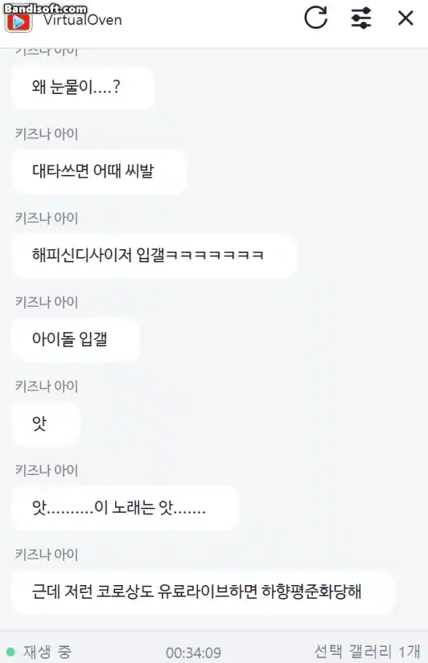

<p align="center">
  
</p>

<h1 align="center">VirtualOven</h1>

<p align="center">
  <strong>차갑게 식어버린 아카이브를 따뜻하게 데워드세요</strong>
</p>

<p align="center">
  
  
  
  
</p>

<p align="center">
  
</p>

VirtualOven은 종료된 공개 YouTube 라이브 또는 Premiere 아카이브를 재생할 때, 당시 디시인사이드에 올라온 중계 게시글을 영상 시각에 맞춰 보여주는 Windows용 도구입니다.

> [!IMPORTANT]
> Chrome 확장프로그램 1.0.0이 정식 릴리즈되었습니다. 기존에 설치했던 확장프로그램을 삭제하고 [Chrome Web Store](https://chromewebstore.google.com/detail/virtualoven/hipjbaibdcfihbhohnlnpgegmanlhggj) 에서 재설치 해주세요.

## 주요 기능

| 기능 | 설명 |
| --- | --- |
| 재생 상태 동기화 | 재생·일시정지·탐색·배속·버퍼링과 광고 상태를 따라 게시글 타임라인을 제어합니다. |
| 여러 갤러리 병합 | 선택한 여러 갤러리의 검색결과를 작성 시각 기준의 타임라인 하나로 합칩니다. |
| 플로팅 타임라인 | 항상 위에 표시되는 창을 자유롭게 이동하고 크기를 조절할 수 있습니다. |
| 영상별 설정 | 영상마다 사용할 갤러리와 싱크 보정값을 따로 저장합니다. |
| 화면 꾸미기 | 글꼴, 글자 크기, 말풍선 간격, 색상, 테마와 배경 투명도를 조절합니다. |
| 원문 연결 | 갤러리 출처와 게시글 제목을 표시하고, 말풍선을 누르면 디시인사이드 원문을 엽니다. |
| 로컬 캐시 | 분석 결과와 설정을 PC에 저장하며, 필요할 때 현재 영상만 갱신하거나 전체 캐시를 초기화할 수 있습니다. |
| 자동 업데이트 | 검증된 최신 클라이언트를 내려받아 설치한 뒤 열려 있던 Chrome 탭을 다시 연결합니다. |

## 동작 방식

```text
YouTube 아카이브 재생
        ↓
Chrome 확장프로그램이 영상과 재생 상태 감지
        ↓
Windows 클라이언트가 선택한 갤러리에서 당시 게시글 검색
        ↓
검색결과를 하나의 시간축으로 병합
        ↓
현재 재생 시각에 맞춰 플로팅 창에 표시
```

VirtualOven은 게시글 작성 시각을 라이브 시작 시각과 비교해 영상의 재생 위치로 변환합니다. 송출 지연이나 편집 때문에 시각이 어긋나는 경우에는 영상별 싱크 설정으로 보정할 수 있습니다.

## 설치

### 시스템 요구사항

- Windows 10 또는 Windows 11 64비트
- Google Chrome 106 이상
- 종료된 공개 YouTube 라이브 또는 Premiere 아카이브

### 설치 순서

1. [Chrome Web Store](https://chromewebstore.google.com/detail/virtualoven/hipjbaibdcfihbhohnlnpgegmanlhggj)에서 VirtualOven 확장프로그램을 설치합니다.
2. [최신 GitHub Release](https://github.com/CobaltBru/VirtualOven-Client/releases/latest)에서 `VirtualOven-Setup-<버전>.exe`를 내려받아 실행합니다.
3. Chrome을 완전히 종료한 뒤 다시 실행합니다.
4. 지원되는 YouTube 아카이브를 열고 영상 아래에 표시되는 VirtualOven 버튼을 누릅니다.

클라이언트는 Chrome 확장프로그램이 필요할 때 자동으로 실행합니다. 별도로 프로그램을 먼저 실행할 필요는 없습니다.

> [!WARNING]
> 현재 베타 설치 파일에는 Authenticode 코드 서명이 적용되지 않아 Windows가 게시자를 확인할 수 없다는 경고를 표시할 수 있습니다. 반드시 이 저장소의 공식 Release에서 받은 파일인지 확인한 뒤 실행해 주세요.

## 사용법

1. 데스크톱 Chrome에서 종료된 공개 라이브 또는 Premiere 아카이브를 엽니다.
2. 영상 아래의  버튼을 누릅니다.
3. 분석이 끝나면 당시 게시글이 현재 재생 시각에 맞춰 플로팅 창에 나타납니다.
4. 우측 상단의 설정 버튼에서 갤러리, 싱크와 화면 스타일을 조정합니다.
5. 게시글 말풍선을 누르면 디시인사이드 원문을 확인할 수 있습니다.

## 탄막 사용법

1. 유튜브 영상 하단 재생바의  버튼을 누릅니다.
2. 탄막을 보고 싶으면 탄막 토글버튼을 On 합니다.
3. 게시글을 불러오느라 1분정도 기다려야 할 수도 있습니다.

다른 YouTube 탭에서도 버튼을 누르면 탭마다 별도의 창이 열립니다. 같은 탭에서 다시 누르면 기존 창이 현재 재생 위치에 맞춰 다시 동기화됩니다.

### 설정

| 탭 | 할 수 있는 작업 |
| --- | --- |
| 현재 영상 | 사용할 갤러리를 선택하고 싱크를 `0.5초` 단위로 조절합니다. |
| 화면 | 글꼴, 크기, 간격, 기본·야간 테마, 세부 색상과 투명도를 설정합니다. |
| 데이터 | 정식·마이너·미니·인물 갤러리를 등록하고 기본 갤러리와 캐시를 관리합니다. |
| 정보 | 버전, Chrome 연결 상태와 저장 위치를 확인하고 업데이트 또는 버그리포트를 실행합니다. |

플로팅 창의 새로고침 버튼은 기존 데이터를 유지한 채 현재 영상의 선택된 갤러리만 다시 분석하고, 성공한 경우에만 새 데이터로 교체합니다.

## 지원 범위

| 구분 | 지원 범위 |
| --- | --- |
| 운영체제 | Windows 10·11 64비트 |
| 브라우저 | 데스크톱 Google Chrome 106 이상 |
| 영상 | 종료된 공개 YouTube 라이브·Premiere 아카이브 |
| YouTube 페이지 | `youtube.com/watch`, `youtube.com/live` |
| 게시판 | 디시인사이드 정식·마이너·미니·인물 갤러리 |
| 표시 정보 | 갤러리 출처, 게시글 제목, 원문 링크 |

일반 업로드 영상, 진행 중인 라이브, 모바일 Chrome은 지원하지 않습니다.

## 업데이트

클라이언트는 시작 직후와 실행 중에 새 정식 Release를 확인합니다. 여러 창이 열려 있어도 PC 전체의 GitHub 확인은 30분에 한 번만 수행하며, `정보 > 업데이트 확인`을 누르면 이 간격과 관계없이 즉시 확인할 수 있습니다. Draft와 prerelease는 자동 업데이트 대상에서 제외됩니다.

설치 전에는 Ed25519로 서명된 업데이트 정보와 설치 파일의 GitHub digest, 파일 크기와 SHA-256을 모두 검증합니다. 검증에 실패하면 실행 중인 클라이언트와 기존 설치를 변경하지 않습니다.

## 문제 해결

### YouTube에 VirtualOven 버튼이 보이지 않습니다

- 지원되는 `youtube.com/watch` 또는 `youtube.com/live` 페이지인지 확인해 주세요.
- 종료된 공개 라이브 또는 Premiere 아카이브인지 확인해 주세요.
- 확장프로그램이 활성화되어 있는지 확인한 뒤 페이지를 새로고침해 주세요.

### 클라이언트를 찾을 수 없다고 표시됩니다

- 최신 Windows 클라이언트가 설치되어 있는지 확인해 주세요.
- 설치 후 열려 있던 Chrome 창을 모두 닫고 다시 실행해 주세요.
- Chrome 확장 아이콘의 팝업에서 감지된 설치 상태를 확인할 수 있습니다.

### 게시글이 없거나 시각이 맞지 않습니다

- 게시글에 해당 YouTube 영상 ID가 포함되어 있어야 검색됩니다.
- 설정에서 올바른 갤러리가 선택되어 있는지 확인해 주세요.
- 플로팅 창의 새로고침 버튼으로 현재 영상 데이터를 다시 수집해 보세요.
- 장면과 반응 시각이 일정하게 어긋난다면 `현재 영상 > 동기화`에서 보정해 주세요.

해결되지 않는 문제는 설정의 `정보 > 버그리포트`에서 진단 정보를 복사한 뒤 [GitHub Issues](https://github.com/CobaltBru/VirtualOven-Client/issues)에 남겨 주세요. 진단 정보는 자동으로 전송되지 않으며, 영상 ID와 선택 갤러리명은 사용자가 동의한 경우에만 포함됩니다.

## 데이터와 개인정보

- 현재 영상 식별과 재생 동기화에 필요한 YouTube 페이지 정보, 공개 영상 정보와 디시인사이드 공개 검색결과만 처리합니다.
- Chrome과 Windows 클라이언트 사이의 재생 정보는 같은 PC 안에서 Native Messaging으로 전달됩니다.
- 검색 캐시, 영상별 설정과 화면 설정은 `%LOCALAPPDATA%\VirtualOven\` 아래의 로컬 데이터베이스에 저장됩니다.
- 계정·로그인 기능, 자체 사용 통계, 원격 분석 서버와 제품 내 광고가 없습니다.
- 게시글 상세 페이지를 일괄 수집하거나 중앙 콘텐츠 데이터베이스를 운영하지 않습니다.
- 진단 로그와 버그리포트는 자동으로 외부에 전송되지 않습니다.

수집 항목, 보관 위치, 외부 서비스 통신과 사용자 선택에 관한 자세한 내용은 [개인정보 처리방침](PRIVACY.md)을 참고해 주세요.

## 알려진 제한사항

- 게시글에 영상 ID가 포함되어 있어야 하므로 당시의 모든 반응을 보여주지는 못합니다.
- YouTube 공개 페이지와 디시인사이드 검색 페이지의 구조나 정책이 변경되면 분석이 일시적으로 실패할 수 있습니다.
- 송출 지연, Premiere 카운트다운 또는 편집된 아카이브에서는 반응 시각과 장면이 어긋날 수 있습니다.
- 삭제되거나 수정된 게시글은 분석 시점의 공개 검색결과와 원문 상태를 따릅니다.
- 일정 구간이 편집된 아카이브는 싱크가 맞지 않게됩니다.

## 후원

VirtualOven은 제품 안에 광고를 넣지 않습니다. 프로젝트가 마음에 들었다면 GitHub Sponsors를 통해 지속적인 유지보수와 개발을 응원해 주세요.

[](https://github.com/sponsors/CobaltBru)

---

*VirtualOven은 YouTube, Google Chrome 또는 디시인사이드의 공식 제품이 아니며 각 서비스와 제휴 관계가 없습니다.*
