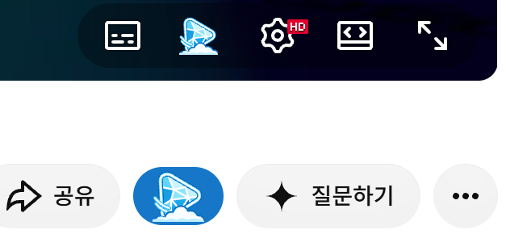
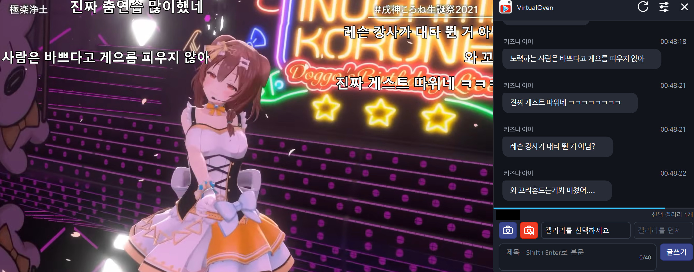
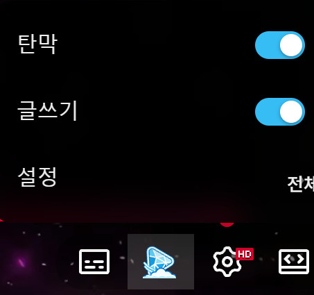
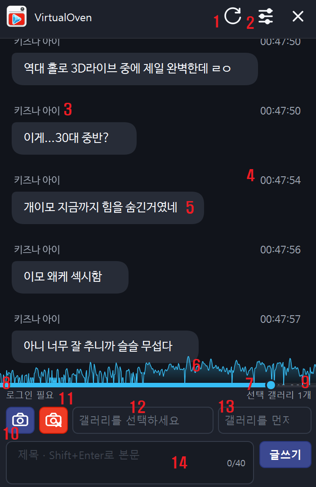
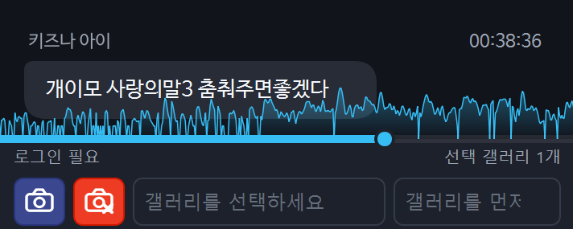
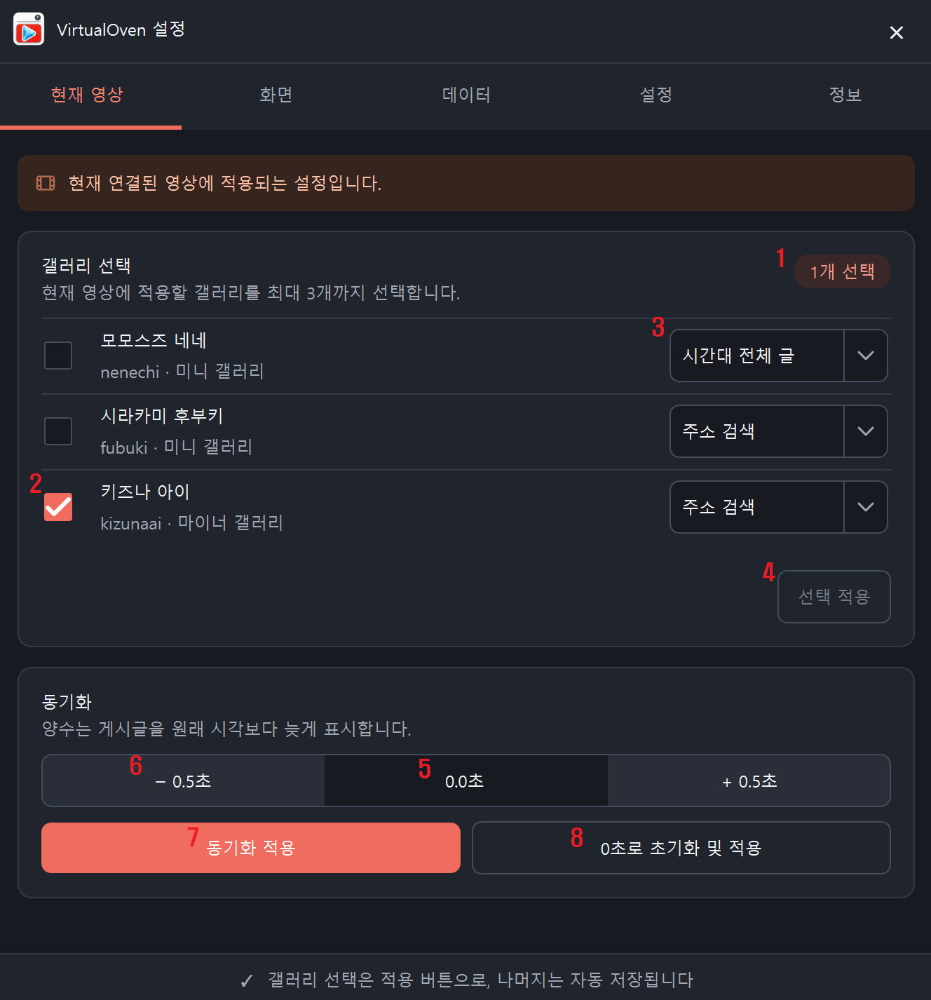
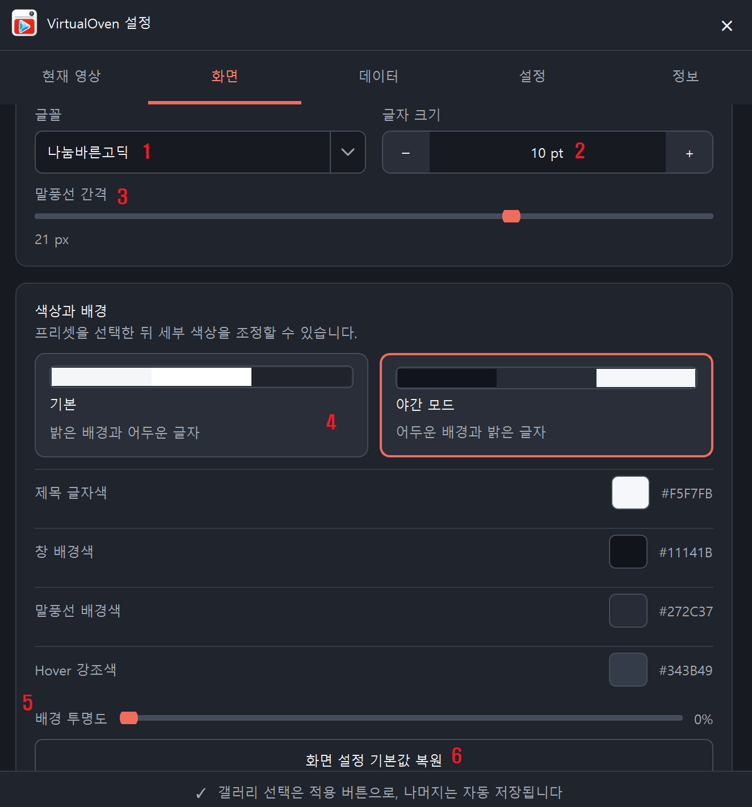
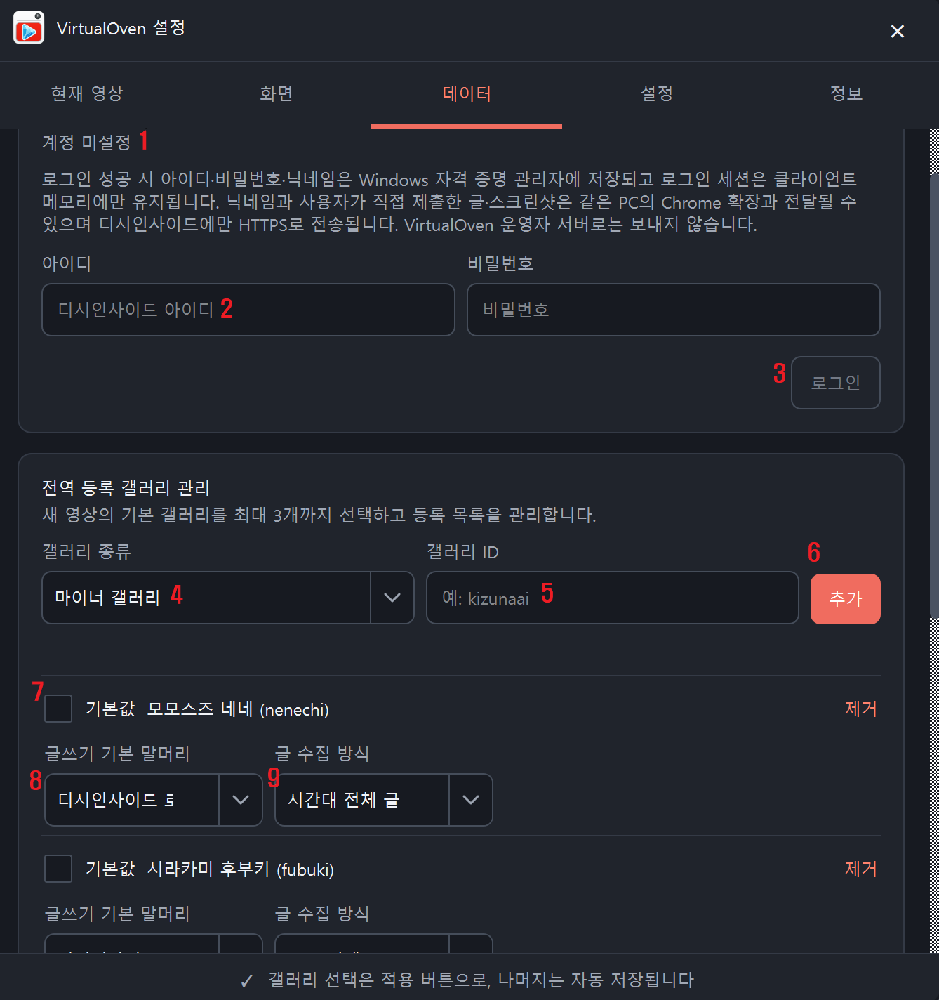
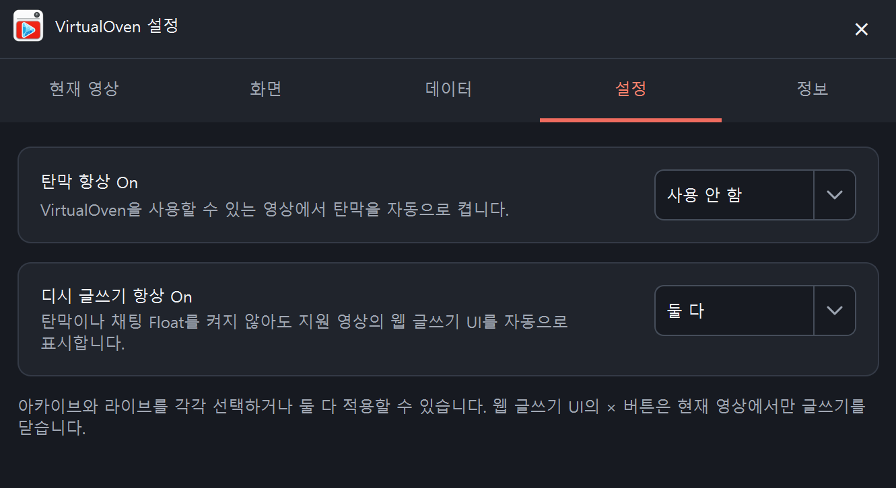
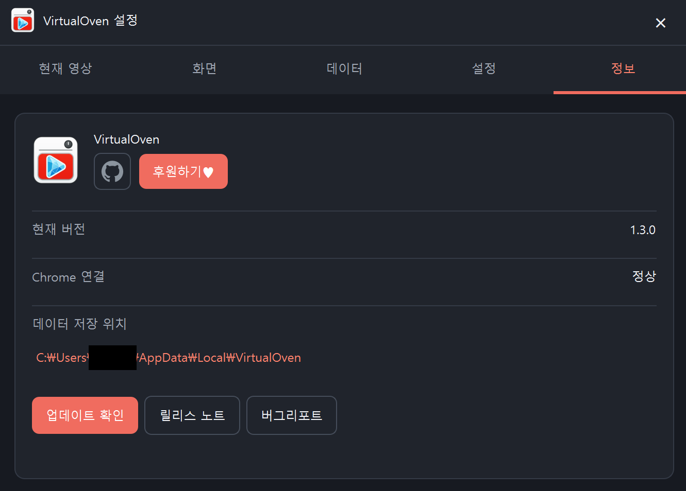

# 중계 도우미 VirtualOven 사용 설명서

VirtualOven은 YouTube와 치지직 라이브·다시보기를 보면서 당시 디시인사이드 반응을
플로팅 타임라인과 플레이어 탄막으로 확인하고, 현재 장면과 함께 글을 직접
작성할 수 있는 종합 중계 도우미 프로그램입니다.

## 목차

1. [설치하고 처음 연결하기](#1-설치하고-처음-연결하기)
2. [지원 영상 화면](#2-지원-영상-화면)
3. [플로팅 클라이언트 화면](#3-플로팅-클라이언트-화면)
4. [설정 — 현재 영상](#4-설정--현재-영상)
5. [설정 — 화면](#5-설정--화면)
6. [설정 — 데이터](#6-설정--데이터)
7. [설정 — 자동 실행과 정보](#7-설정--자동-실행과-정보)
8. [상태 안내와 문제 해결](#8-상태-안내와-문제-해결)

## [1. 설치하고 처음 연결하기](#목차)

VirtualOven은 Chrome 확장 프로그램과 Windows 클라이언트가 함께 동작합니다.

1. [Chrome Web Store](https://chromewebstore.google.com/detail/virtualoven/hipjbaibdcfihbhohnlnpgegmanlhggj)에서 VirtualOven 확장 프로그램을 설치합니다.
2. [공식 GitHub Release](https://github.com/CobaltBru/VirtualOven-Client/releases/latest)에서 `VirtualOven-Setup-<버전>.exe`를 내려받아 설치합니다.
3. 열려 있는 Chrome 창을 모두 닫았다가 다시 실행합니다.
4. 지원되는 YouTube 또는 치지직 라이브·다시보기를 엽니다.
5. 영상 아래의 VirtualOven 아이콘 버튼을 누릅니다.

Windows 클라이언트는 확장이 필요할 때 자동으로 실행하므로 먼저 실행할
필요가 없습니다.

지원 환경:

- Windows 10·11 64비트
- 데스크톱 Google Chrome 109 이상
- 현재 Chrome 계정으로 재생할 수 있는 YouTube 종료 라이브·Premiere 아카이브
- 치지직 라이브와 공식 다시보기
- 진행 중인 YouTube·치지직 라이브
- 디시인사이드 정식·마이너·미니·인물 갤러리
- CPU 4코어 이상 환경에서 최적화

YouTube 일반 업로드 영상, 진행 중인 Premiere, Shorts, 삽입 플레이어와
모바일 페이지는 지원하지 않습니다. 치지직 일반 업로드 영상도 지원하지
않습니다.

영상 아래의 파란 VirtualOven 버튼을 누르면 플로팅 클라이언트가 열립니다.

## [2. 지원 영상 화면](#목차)

지원 영상에서는 플레이어 탄막을 보고, 오른쪽 플로팅 클라이언트에서는
같은 게시글의 출처·영상 시각·원문 링크와 글쓰기 UI를 확인할 수 있습니다.

| 화면 요소 | 설명 |
| --- | --- |
| 영상 정보 영역 VirtualOven 버튼 | 플로팅 클라이언트를 열거나 이미 열린 창을 현재 재생 위치에 다시 맞춥니다. 치지직에서는 항상 `더보기` 바로 왼쪽에 있습니다. |
| 플레이어 VirtualOven 버튼 | YouTube·치지직 플레이어 제어 영역에 있으며 탄막·글쓰기·설정 메뉴를 엽니다. |
| 플레이어 탄막 | 영상 재생 시각에 맞춰 표시되며 일시정지·탐색·배속·버퍼링·광고 상태를 따릅니다. |
| 웹 글쓰기 UI | 현재 영상 화면에서 갤러리·말머리·제목·본문·장면 첨부를 확인하고 글을 게시합니다. |
| 웹 작성줄 닫기 `×` | 현재 영상의 웹 글쓰기 UI만 닫습니다. 플로팅 창과 플로팅 작성줄은 닫지 않습니다. |

### 플레이어 메뉴

플레이어 VirtualOven 버튼을 누르면 `탄막`, `글쓰기`, `설정` 세 항목이
나옵니다. 메뉴를 열고 닫는 것만으로는 상태가 바뀌지 않습니다.

| 메뉴 | 설명 |
| --- | --- |
| 탄막 | 게시글 제목을 플레이어 위에 흐르는 글자로 표시합니다. |
| 글쓰기 | 현재 영상 페이지에 웹 글쓰기 UI를 표시합니다. |
| 설정 | 현재 영상이 선택된 Windows 설정창을 엽니다. |

탄막은 지원 플레이어와 전체화면에서 표시됩니다. YouTube 미니플레이어와
브라우저 PIP 화면 안에는 표시되지 않습니다.

### 웹 글쓰기 UI

웹 글쓰기 UI는 화면 너비와 채팅 상태에 따라 영상 오른쪽 또는 영상 바로
아래에 배치됩니다. 갤러리, 말머리, 캡처와 게시 상태는 플로팅 작성줄과
공유하지만 입력 중인 웹 초안은 웹 화면에 따로 유지됩니다.

작성 항목과 게시 방법은 바로 다음
[플로팅 클라이언트 화면](#3-플로팅-클라이언트-화면)의
`하단 글쓰기 UI` 설명과 같습니다.

## [3. 플로팅 클라이언트 화면](#목차)

플로팅 클라이언트는 게시글 타임라인과 글쓰기 UI를 한 화면에 보여줍니다.
아래 스크린샷 한 장에 모든 번호를 표시하면 이 화면에서 필요한 정보를
한 번에 찾을 수 있습니다.

이미지의 1~14번은 아래 표의 같은 번호와 연결됩니다. 상단에 새로 추가된
`?` 버튼은 새로고침 버튼 왼쪽에 있습니다.

### 화면 전체 구성

| 번호 | 화면 요소 | 설명 |
|---:| --- | --- |
| `?` | 사용 설명서 | 이 웹 사용 설명서를 기본 브라우저에서 엽니다. |
|  1 | 새로고침 | 현재 영상과 선택 갤러리의 게시글 데이터를 다시 수집합니다. 성공한 경우에만 기존 결과를 교체합니다. |
|  2 | 설정 | 현재 영상이 선택된 설정창을 엽니다. |
|  3 | 갤러리 이름 | 이 게시글이 어느 갤러리에서 수집됐는지 보여줍니다. |
|  4 | 영상 시각 | 게시글이 표시되는 영상 위치입니다. 탐색 가능한 영상에서는 누르면 그 시각으로 이동합니다. |
|  5 | 게시글 말풍선 | 디시인사이드 게시글 제목입니다. 누르면 원문을 기본 브라우저에서 엽니다. |
|  6 | 반응 밀도 그래프 | 시간대별 게시글 수를 높낮이로 보여줍니다. 높은 구간일수록 반응이 많습니다. |
|  7 | 재생바 | 현재 영상 위치를 보여줍니다. 원하는 위치를 누르거나 드래그한 뒤 놓으면 원본 영상도 이동합니다. |
|  8 | 계정 상태 | 로그인된 디시 닉네임, `로그인 필요`, `재로그인 필요` 같은 상태를 표시합니다. |
|  9 | 작업 상태 | 선택 갤러리 수, 캡처 오류, 게시 준비·업로드·확인·완료 상태를 표시합니다. |
| 10 | 캡처 버튼 | 현재 영상 장면을 찍습니다. 첨부가 있으면 다시 찍기 상태로 바뀝니다. |
| 11 | 첨부 삭제 | 현재 작성 session에 보관된 스크린샷을 삭제합니다. 첨부가 있을 때만 사용할 수 있습니다. |
| 12 | 글쓰기 갤러리 | 등록된 갤러리 중 실제로 글을 게시할 곳을 선택합니다. |
| 13 | 말머리 | 선택한 갤러리에서 현재 계정이 사용할 수 있는 말머리를 선택합니다. |
| 14 | 제목·본문과 글쓰기 | 제목과 본문을 입력하고 글을 직접 게시합니다. 숫자는 현재 제목 글자 수를 보여줍니다. |

### 상단 툴바

상단의 로고 영역을 끌면 창을 이동할 수 있습니다. 창 가장자리에서는 크기를
조절할 수 있습니다. 새로고침 왼쪽의 `?`를 누르면 사용 설명서가 열립니다.

플로팅 창을 Chrome 또는 PIP 창 가장자리에 가까이 가져가면
도킹됩니다. 도킹 후에는 대상 창의 이동·크기 변경·최소화를 따라갑니다.
크롬 창을 움직이면 도킹이 붙어있으며 클라이언트를 움직이면 도킹이 떨어집니다.

새로고침은 확인 후 시작하며 수집 중에도 기존 타임라인은 계속 보여줍니다.
선택한 갤러리 중 하나라도 실패하면 새 결과를 일부만 적용하지 않고 기존
타임라인을 유지합니다.

오른쪽 위 `×`는 현재 탭의 플로팅 창을 닫습니다. 같은 탭에서 탄막을 사용
중이면 탄막과 Native 연결은 계속 유지됩니다.

### 게시글 영역

게시글 하나는 `갤러리 이름 → 영상 시각 → 제목 말풍선` 순서로 읽습니다.

- 갤러리 이름은 여러 갤러리의 글이 섞였을 때 출처를 구분합니다.
- 영상 시각은 게시글 작성 시각을 영상 시간축으로 변환한 값입니다.
- 영상 시각을 누르면 해당 장면으로 이동합니다.
- 말풍선을 누르면 디시인사이드 원문을 엽니다.

타임라인을 위로 올려 과거 글을 읽는 동안 새 글이 들어오면 오른쪽 아래에
`새 글 N개 ↓`가 나타납니다. 이 버튼을 누르면 최신 글로 돌아가고 이후
글을 다시 자동으로 따라갑니다.

### 재생바와 반응 밀도

글쓰기 UI 바로 위의 얇은 재생바에 마우스를 올리면 진행선과 반응 밀도가
펼쳐집니다.

- 진행 위치: 현재 영상 재생 시각
- 그래프 높이: 해당 구간의 상대적인 게시글 수
- 클릭 또는 드래그 후 놓기: 해당 장면으로 이동
- 라이브: 플랫폼이 DVR을 허용하는 구간에서만 탐색 가능

탐색 직후에는 새 영상 위치가 안정될 때까지 게시글 진행을 잠시 멈춘 뒤
다시 시작합니다. 광고와 버퍼링 중에도 본편 시각을 진행하지 않습니다.

### 하단 글쓰기 UI

플로팅 화면에서 게시글을 읽은 다음 바로 아래 작성줄에서 글을 작성합니다.

첫 번째 줄:

1. `캡처`: 현재 디코딩된 영상 장면을 첨부합니다.
2. `삭제`: 첨부된 장면을 제거합니다.
3. `갤러리`: 글을 게시할 갤러리를 선택합니다.
4. `말머리`: 해당 계정과 갤러리에서 사용할 수 있는 말머리를 선택합니다.

두 번째 줄:

1. 제목을 입력합니다.
2. `Shift+Enter`를 한 번 누르면 그다음부터 본문을 입력합니다.
3. 오른쪽 숫자로 제목 글자 수를 확인합니다.
4. 내용을 확인한 뒤 `글쓰기`를 누릅니다.

입력 제한:

- 제목 2~40자
- 본문 최대 250자
- 제목이 40자에 도달하면 이후 입력은 본문으로 이어짐
- 게시되는 본문 마지막에 `- Virtual Oven` 꼬리말 추가

캡처 이미지:

- 현재 video의 디코딩 원본 프레임 사용
- 자연 비율 유지
- 최대 `1280 × 720`
- WebP 품질 100, 최대 5MiB
- 한 장만 보관
- 탄막이 켜져 있으면 현재 영상 영역의 탄막도 함께 합성

재캡처에 실패하면 기존 첨부를 유지합니다. 초안과 첨부는 현재 작성
session의 메모리에만 있으며 영상이나 페이지를 벗어나면 삭제됩니다.

게시 중에는 상태 영역에 `게시 준비 중`, `이미지 업로드 중`,
`등록 확인 중`, `등록 완료`가 표시됩니다. 한 번에 한 건만 게시할 수 있고
작업 후에는 글쓰기 버튼에 5초 쿨타임이 표시됩니다.

게시 성공 여부를 확인할 수 없으면 자동으로 다시 게시하지 않습니다.
중복 게시를 막기 위해 실제 갤러리에서 등록 여부를 먼저 확인하세요.

## [4. 설정 — 현재 영상](#목차)

모든 설정 탭의 제목 표시줄은 같습니다. 오른쪽 `?`는 사용 설명서를 열고,
그 오른쪽 `×`는 설정창을 닫습니다.

| 번호 | 화면 요소 | 설명 |
|---:| --- | --- |
|  1 | 갤러리 선택 수 | 현재 영상에 선택된 갤러리 개수를 표시합니다. 최대 세 개입니다. |
|  2 | 갤러리 체크박스 | 현재 영상의 타임라인에 포함할 갤러리를 선택합니다. |
|  3 | 글 수집 방식 | 갤러리마다 `주소 검색` 또는 `시간대 전체`를 선택합니다. |
|  4 | 선택 적용 | 새 선택의 수집이 모두 성공한 뒤 영상 설정과 타임라인을 교체합니다. |
|  5 | 동기화 값 | 게시글 표시 시각을 `-300초~+300초` 범위에서 조절합니다. |
|  6 | `− 0.5초`·`+ 0.5초` | 싱크 값을 반 초 단위로 조절합니다. |
|  7 | 동기화 적용 | 입력한 싱크 값을 현재 영상에 저장하고 즉시 반영합니다. |
|  8 | 0초로 초기화 | 현재 영상의 싱크를 기본값으로 되돌립니다. |

### 글 수집 방식

`주소 검색`은 YouTube에서는 현재 영상 ID, 치지직에서는 방송 채널 ID가
제목이나 본문에 들어간 글을 찾습니다. 영상 또는 방송 채널 링크를 남기는
중계 갤러리에 적합합니다. 글쓰기 링크는 치지직 라이브에서는 방송 채널
주소, 다시보기에서는 해당 다시보기 주소를 사용합니다.

`시간대 전체`는 영상이 실제로 진행된 시간대에 작성된 일반 게시글을 모두
수집합니다. 영상 링크를 남기지 않는 중계 갤러리에 적합하지만 같은 시간대의
관련 없는 글도 포함될 수 있습니다.

새 갤러리의 기본값은 `주소 검색`입니다. 수집 실패를 숨기기 위해 다른
방식으로 자동 변경하지 않습니다.

### 동기화

양수는 게시글을 원래 시각보다 늦게, 음수는 더 일찍 표시합니다. 방송 지연
등으로 전체 반응이 일정하게 어긋날 때 조절합니다. 영상 중간 편집처럼
구간마다 차이가 다르면 하나의 값으로 전체를 맞출 수 없습니다.

## [5. 설정 — 화면](#목차)

| 번호 | 화면 요소 | 설명 |
|---:| --- | --- |
|  1 | 글꼴 | 플로팅 타임라인에서 사용할 글꼴을 선택합니다. |
|  2 | 글자 크기 | `8~24pt` 범위에서 조절합니다. |
|  3 | 말풍선 간격 | 게시글 사이의 세로 간격을 조절합니다. |
|  4 | 기본·야간 모드 | 색상 조합을 한 번에 적용합니다. |
|  5 | 배경 투명도 | 플로팅 창 배경을 투명하게 조절합니다. |
|  6 | 기본값 복원 | 화면 설정을 초기값으로 되돌립니다. |

화면 설정은 저장과 동시에 현재 열린 모든 플로팅 창에 적용됩니다.

## [6. 설정 — 데이터](#목차)

이미지의 1~9번은 아래 계정·갤러리 표의 같은 번호와 연결됩니다.

### 디시인사이드 계정

| 번호 | 화면 요소 | 설명 |
| ---: | --- | --- |
| 1 | 계정 상태 | 로그인 여부, 닉네임, 재로그인 또는 삭제 필요 상태를 표시합니다. |
| 2 | 아이디·비밀번호 | 로그인 검증에 사용할 회원 정보를 입력합니다. |
| 3 | 로그인·로그아웃 | 로그인 성공 후 Windows 자격 증명 관리자에 정보를 저장하거나 저장 정보를 삭제합니다. |

회원 쿠키는 클라이언트 메모리에만 유지하며 Chrome 확장에 아이디,
비밀번호나 쿠키를 전달하지 않습니다. 캡차와 추가 인증은 우회하지 않습니다.

### 전역 등록 갤러리

| 번호 | 화면 요소 | 설명 |
|---:| --- | --- |
|  4 | 갤러리 종류 | 정식·마이너·미니·인물 중 하나를 선택합니다. |
|  5 | 갤러리 ID | 예: `kizunaai`처럼 주소의 갤러리 ID를 입력합니다. |
|  6 | 추가 | 실제 갤러리를 확인한 뒤 등록 목록에 추가합니다. |
|  7 | 기본 선택 | 앞으로 처음 여는 영상에 기본으로 적용할 갤러리를 최대 세 개 선택합니다. |
|  8 | 글쓰기 기본 말머리 | 새 작성 session에서 우선 선택할 말머리를 정합니다. 실제 계정 목록에 있을 때만 적용됩니다. |
|  9 | 글 수집 방식 | 앞으로 처음 여는 영상에 복사할 기본 수집 방식을 정합니다. |

전역 기본값을 바꿔도 이미 사용한 영상의 선택과 수집 방식은 자동으로
바뀌지 않습니다.

## [7. 설정 — 자동 실행과 정보](#목차)

### 설정 탭

| 화면 요소 | 설명 |
| --- | --- |
| 탄막 항상 On | 새 지원 영상에서 탄막을 자동으로 켤 범위를 정합니다. |
| 디시 글쓰기 항상 On | 탄막이나 플로팅 창 없이도 웹 글쓰기 UI를 자동으로 표시할 범위를 정합니다. |

두 항목은 각각 `사용 안 함`, `아카이브`, `라이브`, `둘 다` 중 하나를
선택합니다. 웹 글쓰기 UI의 `×`는 현재 영상에서만 글쓰기를 닫습니다.

### 정보 탭

| 화면 요소 | 설명 |
| --- | --- |
| GitHub 버튼 | VirtualOven 공식 저장소를 엽니다. |
| 후원하기 | GitHub Sponsors 페이지를 엽니다. |
| 현재 버전 | 설치된 Windows 클라이언트 버전입니다. |
| Chrome 연결 | 현재 확장과 연결된 상태를 보여줍니다. |
| 데이터 저장 위치 | `%LOCALAPPDATA%\VirtualOven\` 폴더를 탐색기에서 엽니다. |
| 업데이트 확인 | 정기 확인을 기다리지 않고 최신 정식 Release를 확인합니다. |
| 사용 설명서 | 현재 보고 있는 웹 사용 설명서를 엽니다. |
| 릴리스 노트 | 현재 버전의 변경 내용을 표시합니다. 하단에는 `GitHub에서 전체 내용 보기`, `사용 설명서`, `후원하기♥` 버튼이 순서대로 있습니다. |
| 버그리포트 | 로컬 진단 정보를 확인하고 복사하는 창을 엽니다. |

로컬 폴더에는 검색 캐시, 설정과 오류 로그가 저장됩니다. 작성 초안,
회원 쿠키와 캡처 이미지는 파일에 저장하지 않습니다.

업데이트 설치 전에는 서명, 파일 크기, digest와 SHA-256을 검증합니다.
검증에 실패하면 기존 설치를 변경하지 않습니다.

버그리포트는 자동으로 전송되지 않습니다. 사용자가 복사된 내용을 확인한 뒤
직접 GitHub Issue에 붙여넣고 제출합니다.

## [8. 상태 안내와 문제 해결](#목차)

### 플로팅 화면 중앙 안내

| 안내 | 의미와 조치 |
| --- | --- |
| 게시글을 준비하고 있습니다 | 현재 위치 미리보기 또는 전체 수집이 진행 중입니다. 잠시 기다립니다. |
| 검색된 중계 글이 없습니다 | 현재 영상·갤러리·수집 방식에서 결과가 없습니다. 현재 영상 설정을 확인합니다. |
| 게시글을 불러오지 못했습니다 | 네트워크, 갤러리 구조 또는 안전 제한 오류입니다. 표시된 원인을 확인한 뒤 새로고침합니다. |
| 확장 프로그램 교체 필요 | 현재 클라이언트와 맞는 최신 Chrome 확장을 설치합니다. |

### 화면별 빠른 확인

| 문제 | 확인할 곳 |
| --- | --- |
| 영상 페이지에 연결 버튼이 없음 | 지원되는 YouTube `/watch`·`/live` 또는 치지직 `/live`·`/video`인지, 확장이 활성화됐는지 확인 |
| 클라이언트를 찾을 수 없음 | Windows 클라이언트 설치 후 Chrome 완전 재시작 |
| 게시글이 없음 | `현재 영상` 탭의 갤러리와 `주소 검색`·`시간대 전체` 선택 확인 |
| 게시글 시각이 어긋남 | `현재 영상 > 동기화`에서 반 초 단위 보정 |
| 탄막이 보이지 않음 | 플레이어 메뉴의 탄막 상태와 미니플레이어·PiP 여부 확인 |
| 글쓰기 버튼이 비활성 | 로그인, 갤러리, 말머리, 제목 길이, 진행 중 작업과 쿨타임 확인 |
| 게시 결과를 확인할 수 없음 | 자동 재시도하지 말고 실제 갤러리에서 등록 여부 확인 |
| 업데이트 실패 | 다른 Windows session의 VirtualOven 종료 후 로컬 업데이트 로그 확인 |

해결되지 않으면 `설정 > 정보 > 버그리포트`에서 진단 정보를 복사한 뒤
GitHub Issue에 직접 첨부하세요. 비밀번호, 쿠키와 인증 정보는 작성하지
마세요.
